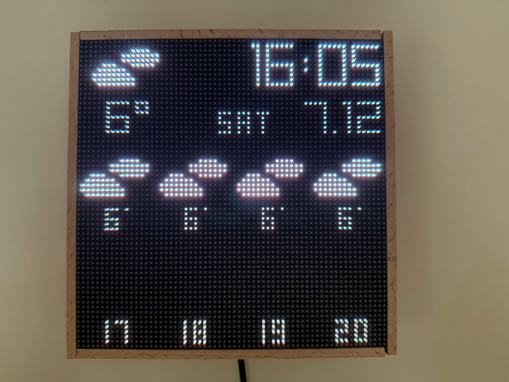
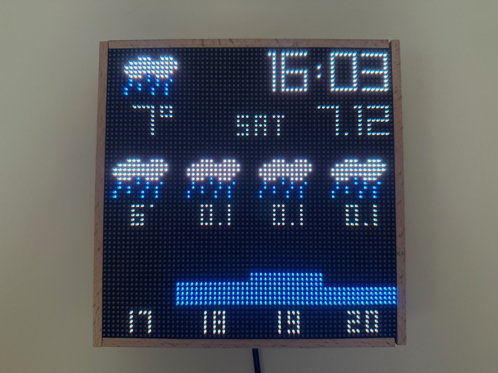
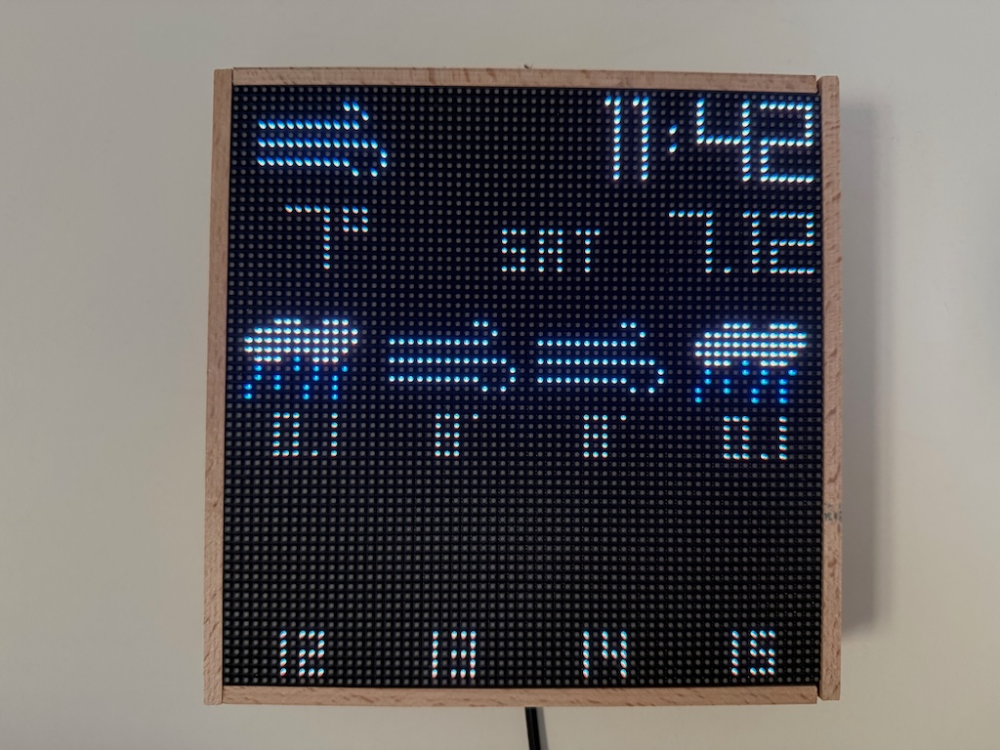

# LED RGB Matrix Clock

  

> [!NOTE]
> Instructions may be incomplete as it has been a while since I set this up.

## Hardware I use
- Raspberry Pi 4 Model B
- Waveshare RGB LED Matrix screen (64x64) with 3mm Pitch (https://www.amazon.co.uk/gp/product/B0B5XSQM6Z/)

Look for instructions on how to connect the screen to the Raspberry Pi online as this repo is not about wiring.

## Software I use

- Ubuntu Server 20.04
- You will need to install Go on the Raspberry Pi to build the project.
- SDL2 (https://www.libsdl.org/) to render the screen.
- https://github.com/veandco/go-sdl2 - to draw pixels on virtual surface
- https://github.com/zaggash/go-rpi-rgb-led-matrix - to render pixels on the LED screen
- OpenMeteo API to get the weather data (https://open-meteo.com/)

You will need to build the Go executable on the Raspberry Pi itself.

## Installation

- `sudo apt install build-essential`
- install Go
- install SDL2 (refer to the SDL2 documentation and Google if any issues)

## Build and run

- `go build`
- `./led-clock`

This will run with the default configuration. You can pass the following flags to the executable:

- `-latitude` - latitude of the location
- `-longitude` - longitude of the location
- `-timezone` - timezone of the location

```bash
sudo ./led-clock -latitude=52.3738 -longitude=4.8910 -timezone=Europe/Amsterdam
```

## Run as a Service

I run the executable as a service. Here is an example of the service file:

```ini
[Unit]
Description=LED Clock
After=multi-user.target

[Service]
ExecStart=/home/serhiy/led-clock/led-clock -latitude=52.3738 -longitude=4.8910 -timezone=Europe/Amsterdam
WorkingDirectory=/home/serhiy/led-clock
KillMode=process
Restart=always
RestartSec=10
Type=simple
User=root
Environment="SDL_VIDEODRIVER=dummy"

[Install]
Alias=led-clock.service
```

## Configuration

Look at config.go file to change some configuration parameters of the clock. E.g. weather units.

> [!NOTE]
> - Works only with 64x64 LED screen. May be adopted for other screens.
> - Must be run as root.
> - Must be run with `SDL_VIDEODRIVER=dummy` environment variable if no display is available.
> - `XDG_RUNTIME_DIR=/run/user/1000` may need to be set.
> - Using Echo Go library with the idea to extend the clock with http commands.
